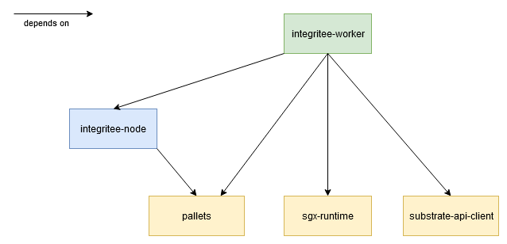

# For Developers

This document describes the SDK version **0.9.0**.

The SDK spans components from multiple Integritee GitHub repositories:

* [integritee-worker](https://github.com/integritee-network/worker)
* [integritee-node](https://github.com/integritee-network/integritee-node)
* [sgx-runtime](https://github.com/integritee-network/sgx-runtime)
* [integritee-pallets](https://github.com/integritee-network/pallets)

The SDK on each of these repositories has a release branch `sdk-v0.9.0-polkadot-v0.9.26`.

These repositories are interdependent, as is described in the following diagram:



The different variants of SDKs are:

* [Sidechain SDK](./sidechain-sdk.md)
* [Offchain-worker SDK](./offchain-worker-sdk.md)
* [Teeracle SDK](./teeracle.md)

## SDK Versioning with release branches

Our SDK is released on stable release branches. An SDK release branch is available for all the above mentioned repository components. Their respective cargo dependencies point to the correct release branches. E.g. the `cargo.toml` in the worker will have the dependencies `sgx-runtime` and `node-runtime` defined as:
```TOML
sgx-externalities = { ..., git = "https://github.com/integritee-network/sgx-runtime", branch = "sdk-v0.9.0-polkadot-v0.9.26" }
```
```TOML
my-node-runtime = { ..., git = "https://github.com/integritee-network/integritee-node", branch = "sdk-v0.9.0-polkadot-v0.9.26", ... }
```

The versioning scheme of these release branches is `sdk-v0.9.0-polkadot-v0.9.26`. The first part (`sdk-v0.9.0`) denotes the version of the SDK itself, the second part is the substrate version that this SDK version is based on ([`polkadot-v0.9.26`](https://github.com/paritytech/substrate/tree/polkadot-v0.9.26) in this example).