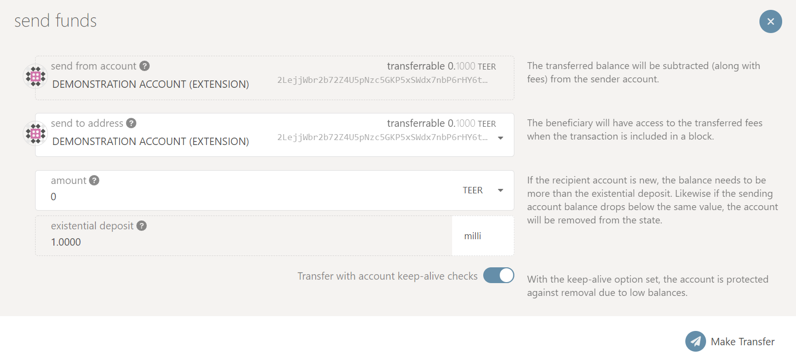

# Wallet and Account

#### <mark style="color:orange;">**1. WHAT IS A SUBSTRATE WALLET?**</mark> 

If you have been digging around the Polkadot or Kusama space you will have undoubtedly come accross the term ‘Substrate’. Some of the most exciting projects in decentralized tech are building on Substrate, creating Polkadot parachains, independent layer-1 blockchains, and infrastructure.

&#x20;

All Substrate-based chains are seamlessly compatible with Polkadot, granting access to a rich, interoperable ecosystem of parachains, applications, and resources.

\
What does this mean for your wallet? Well you can create a wallet using [polkadot{.js}](https://polkadot.js.org/) and a browser extension. Once you have created this wallet it is effectively interoperable between all substrate chains. So you will be able to view, manage and send tokens for any project on Polkadot or Kusama (see parachains) or any standalone Substrate-based solo chains.\

&#x20;<mark style="color:orange;"></mark> <mark style="color:orange;"></mark><mark style="color:orange;">**2. HOW TO SET UP A WALLET?**</mark>

First you will need to navigate to [polkadot{.js}](https://polkadot.js.org/) and from there follow the following steps:

* Set up your browser extension [Polkadot-js extension, manage accounts for substrate based chains](https://polkadot.js.org/extension/) for either chrome or Firefox.

.png>)

* Create a new account and make sure you back up the seed phrase securely and protect the account with a strong password.

.png>)

* Then you can select any chain you want from the drop down list in the extensions to suit the corresponding chain you have selected in [Polkadot/Substrate Portal](https://polkadot.js.org/apps/).

.png>)

* If you are looking for Integritee remember to visit the Integritee Parachain on the [Polkadot/Substrate Portal](https://polkadot.js.org/apps/?rpc=wss%3A%2F%2Fkusama.api.integritee.network#/explorer) and click _Settings → Metadata → Update Metadata_ to make sure the metadata for your extension is up to date.

<mark style="color:orange;">**2.2 Address format**</mark>

Integritee uses the Substrate-based chain address format SS58. Read more [here](https://wiki.polkadot.network/docs/en/learn-accounts).

* Integritee Network addresses usually but not always start with the number 2.
* Polkadot addresses always start with the number 1.
* Kusama addresses always start with a capital letter like C, D, F, G, H, J...
* Generic Substrate addresses start with 5.

#### <mark style="color:orange;">**3. HOW TO USE THE WALLET?**</mark> 

Please navigate to [Polkadot/Substrate Portal](https://polkadot.js.org/apps/?rpc=wss%3A%2F%2Fkusama.api.integritee.network#/accounts) where you will be able to see your balance if you have any as well as any possible vesting/lockup restrictions on your tokens - be sure that your extension is set to the right chain:

.png>)

From here you will be able to transfer $TEER to other compatible wallet addresses if you want to - as well as unlock any vested amounts.

&#x20;

* Sending $TEER

If you click on the send icon you will be given the option to enter a recipient address as well as a few other options:

Once you are sure that you have entered the correct recipient address - click on ‘Make Transfer’ where you will be asked to provide your wallet password via the extension to sign-off the transaction. Make sure you never disclose this password to anyone.
