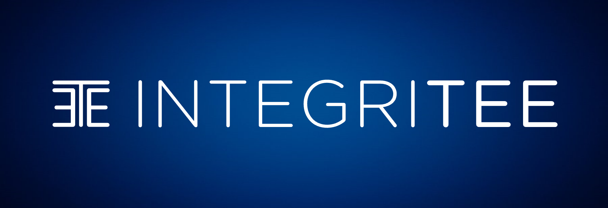

# Visual Materials

### **Logo Assets**&#x20;

\
We provide developers and other professionals with visual materials such as videos, logos, fonts, and more. You can access them in our Media Kit [here](https://drive.google.com/drive/folders/1O1F41n\_jm4hRaeF1QNxGd\_nDlVtn2Ti\_).

Integritee welcomes partnerships of different sorts. If you have an idea you believe is worth sharing with us, contact our team by sending an email to hello@integritee.network.

#### Logos

L1. 

L2. 

L3. 

#### Choice of Color

* On a white background, the "blue text" logo is preferred, and blue logos can also be used (For instance L1., L2., L3.).&#x20;

* On a blue/dark background, the "white text" logo is preferred, and pure white logos can also be used. This logo can be found in our Media Kit linked above, with a transparent background.&#x20;

####

#### Token asset

TEER 

#### Color scheme

Pallette of Integritee colors&#x20;

**Primary Colour:** HEX #000563 

**Accent Colour:** HEX #75e6da 

**Neutral Accent:**  HEX #658ea9 

